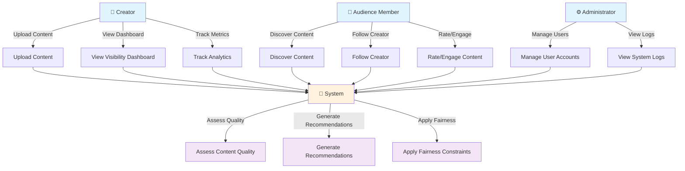
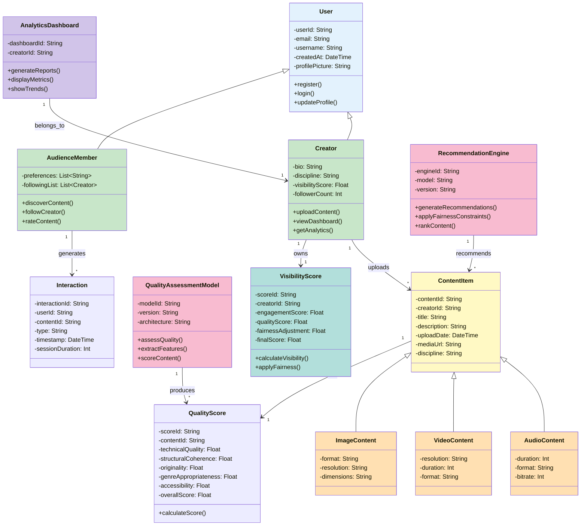
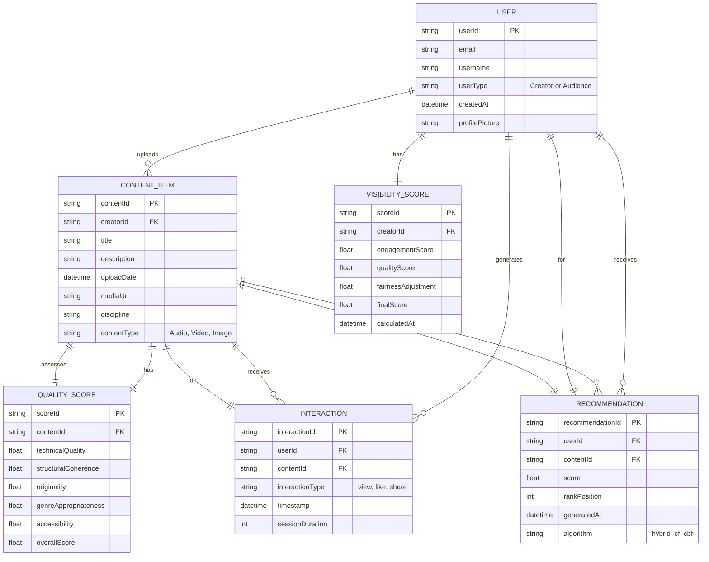
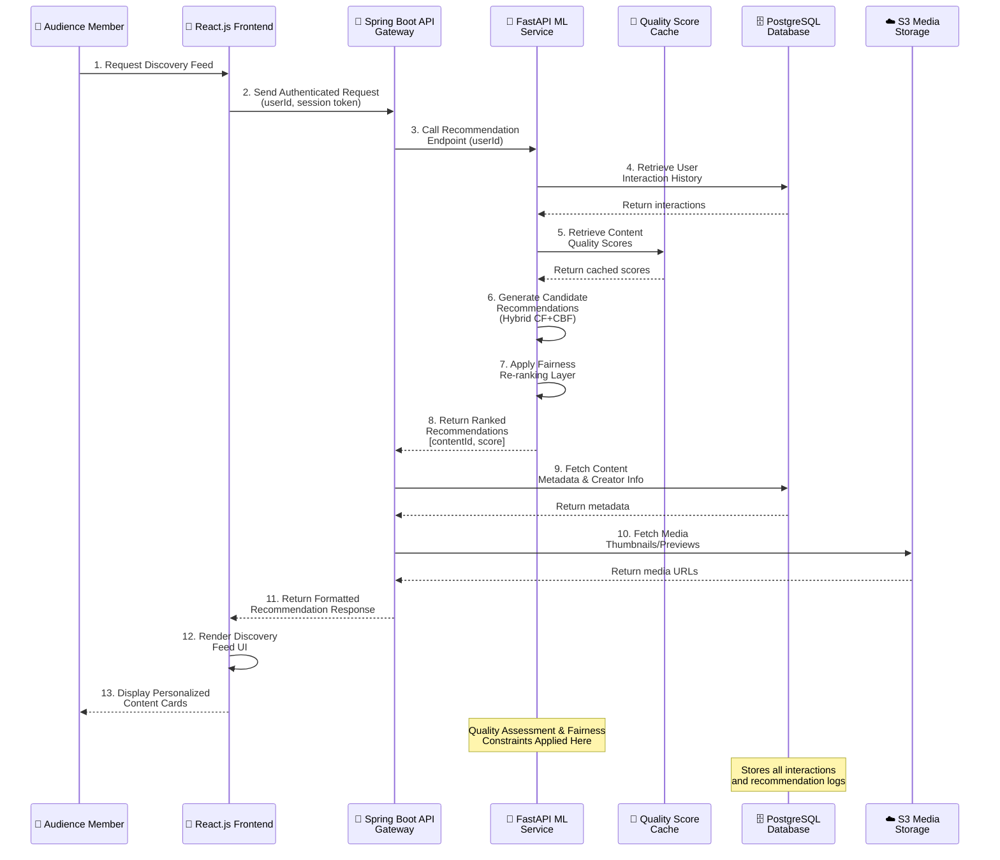
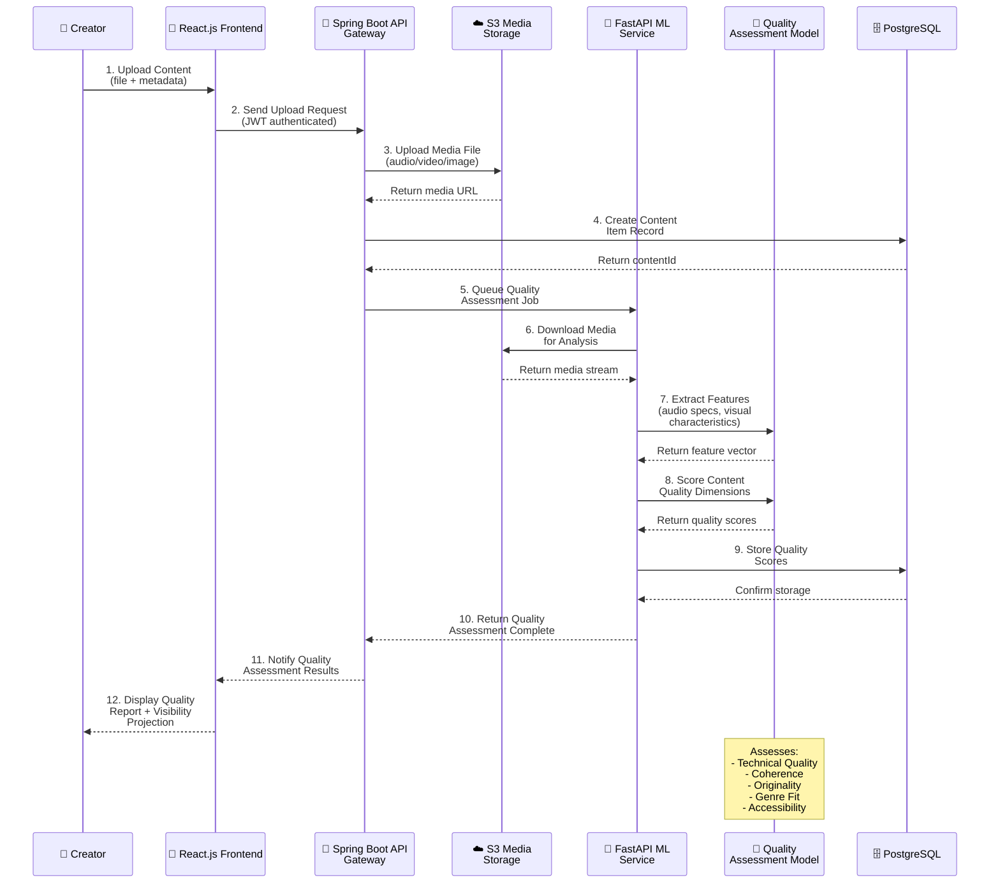
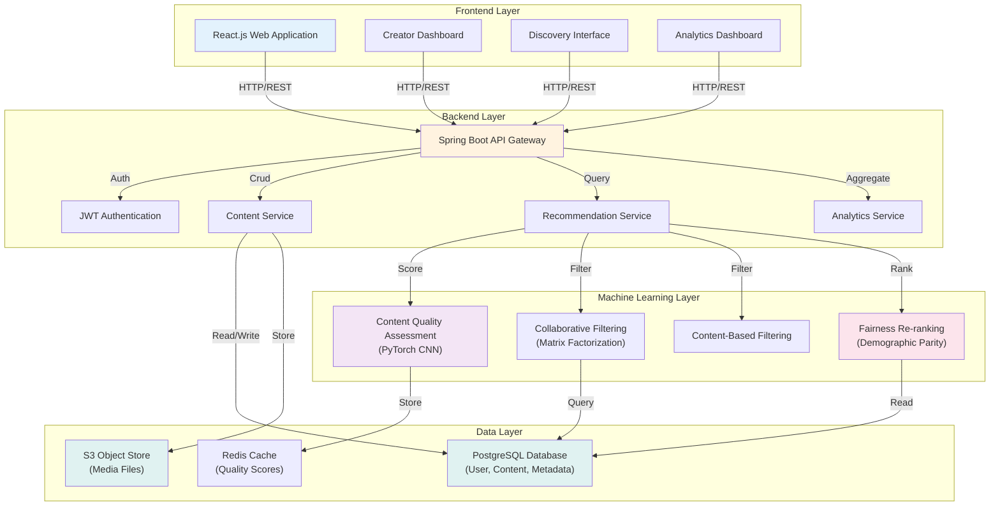

# UML Diagrams - AI-Powered Talent Discovery Platform

## 3.5.1 Use Case Diagram

## 3.5.2 Class Diagram

## 3.5.3 Entity Relationship Diagram

## 3.5.4 Sequence Diagram - Content Recommendation Flow

## 3.5.5 Content Upload and Quality Assessment Flow

## 3.5.6 System Architecture Layers

---

## Diagram Legend

| Color | Component Type |
|-------|----------------|
| 🔵 Blue | User/Frontend Components |
| 🟠 Orange | Backend Services |
| 🟣 Purple | Machine Learning Components |
| 🟢 Green | Data Storage/Cache |

